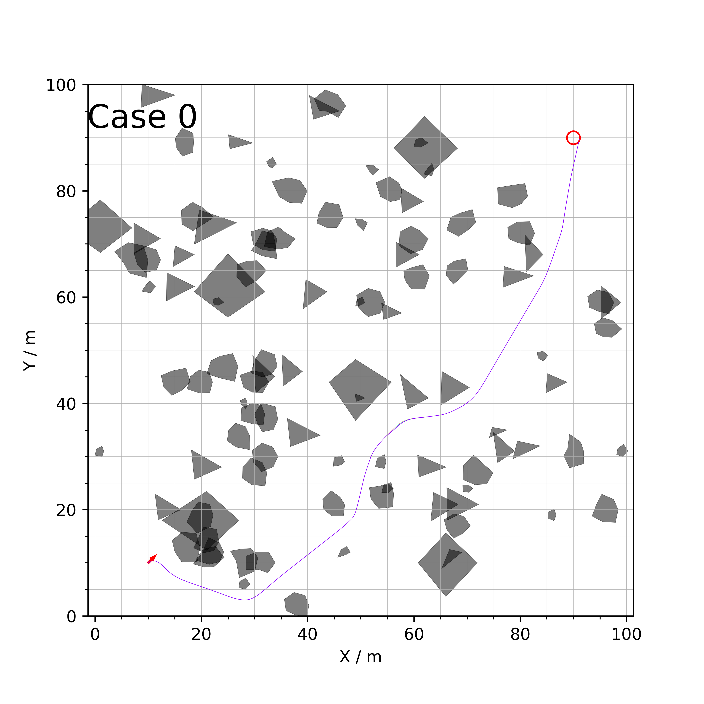
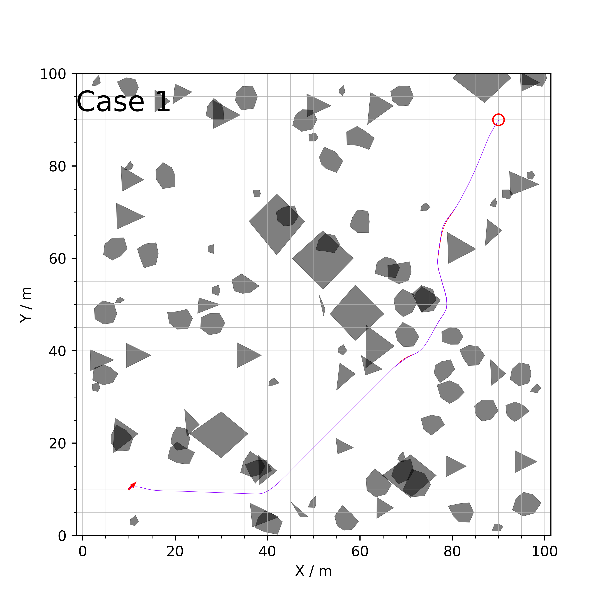
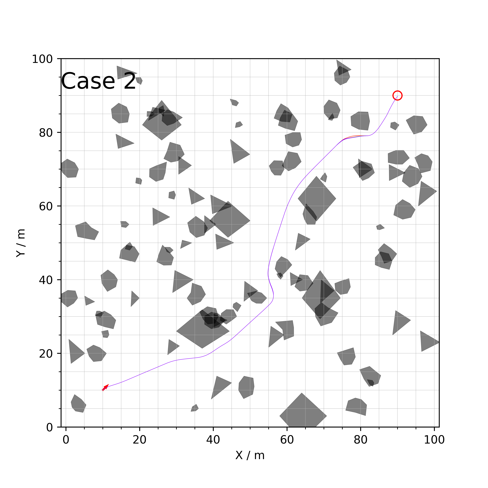

## Reactive Pure Pursuit Control Based AGV Path Planner 
This repository implemented a fast path planner for an autonomous ground vehicle in cluttered environments.
### Requirement

*   Python 3.6 or above
*   Scipy

### Example



Random test case with 100 obstacles in a 100m X 100m environment

### Acknowledgement

Copyright (C) 2022 Bai Li and YaZhou Wang


```python

```
# Reactive_Pure_Pursuit_Control_Based_AGV_Path_Planner
